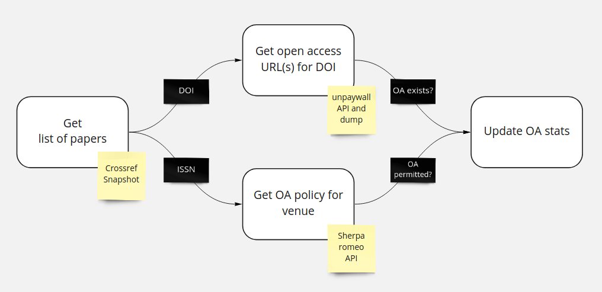

# Increase visibility of untapped OpenAccess potential


This repository contains an exploratory data analysis pipeline to quantify the number of
- paywalled papers that allow but lack OpenAccess author copies
- open access / paywalled papers by author or institution

The hypothesis is, that a significant fraction of scholarly publications that are
currently hidden behind paywalls in fact allow free-of-charge republishing as
OpenAccess.

Should there be evidence for this hypothesis by the above mentioned metrics, the goal is
to create a tool for authors and/or institutions to check which of their papers could be
republished as OpenAccess without additional cost.


## Architecture / Data Flow




## Setup & Test

### Python

Install the package in development mode in a Python 3.7 or 3.8 environment from the root
of the repository as follows

```
pip install -e .[dev]
```

and then run the tests with

```bash
pytest tests/
```

### Docker

To build the Docker image use the following in the repository root
```
docker build -t fyscience .
```
which can then be run via either one of the two following commands
```
docker run -d --name fyscience -p 80:80 --env-file .env fyscience
docker run -t -i -p 80:80 --env-file .env fyscience
```
with an `.env` file containing the following variables:
* `SHERPA_API_KEY`
* `UNPAYWALL_EMAIL`
